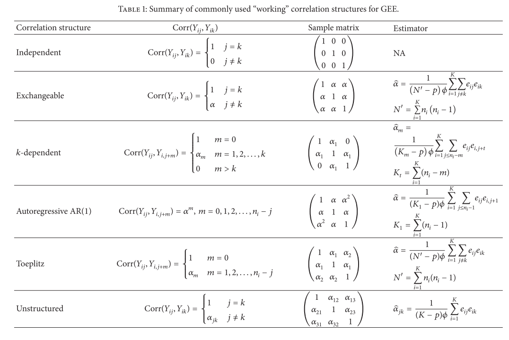

# Background

* https://en.wikipedia.org/wiki/Generalized_estimating_equation
* https://online.stat.psu.edu/stat504/node/180/
* https://wildlifesnpits.wordpress.com/2014/10/24/dealing-with-ugly-data-generalized-estimating-equations-gee/

Generalized estimating equations (GEE) are an extension of generalized linear models for the analysis of clustered (e.g. longitudinal) data.
First introduced by [@Liang1986], the main use case is consistent estimation of parameters of a generalized linear model *even when the covariance structure is misspecified*.
GEEs provide population level estimates -- we can't get subject-specific estimates.

With a single observation of each subject, a generalized linear model can be applied to obtain parameter estimates for a variety of continuous or discrete outcome variables.
With repeated observations, however, the correlation among values for a given subject must be taken into account.
Put another way: GEE does not have distributional assumptions.

So why use GEEs over the likelihood-based generalized linear mixed model?
Supposedly because [@Fong2010] the latter is highly sensitive to variance structure specification.

* Closely related to quasi-likelihood

# Conditional versus marginal models

As per [@Lee2004]:

Consider a random-effect model

$$
y_{ij} = x_{ij} \beta + \nu_i + e_{ij}
$$

where $\nu_{i} \sim N(0, \lambda)$ is a random effect and $e_{ij} \sim N(0, \phi)$.
And a marginal model

$$
E(y_{ij}) = x_{ij} \beta
$$

where the parameters in $\text{Var}(y) = \Sigma$ are nuisance parameters that have an arbitrary chosen pattern.

An obvious advantage of using a random-effect model is that they allow conditional inferences in addition to marginal inferences.
For instance, we can obtain not only a conditional mean

$$
\mu_{ij}^c = E(y_{ij} | \nu_i) = x_{ij} \beta + \nu_i
$$

but also the marginal mean

$$
\mu_{ij} = E(\mu_{ij}^c) = E(y_{ij}) = x_{ij} \beta.
$$

With the marginal model, we can only obtain the marginal mean $\mu_{ij}$.

# `geepack`

[@Halekoh2006]

```{r setup, message=F}
library(tidyverse)
library(gt)
library(here)
library(geepack)
library(corrr)

# Set ggplot2 theme and defaults
theme_set(cowplot::theme_cowplot() + cowplot::background_grid(major = "xy"))
ggp <- function(...) ggplot(...) +
  scale_color_brewer(palette = "Set1") +
  scale_fill_brewer(palette = "Set1")
```

## 2. An example data set

The `respiratory` data set:

```{r}
data(respiratory)

glimpse(respiratory)
```

comes from a clinical study of a treatment on patients with respiratory illness.
A total of `r nrow(respiratory %>% distinct(center, id))` patients (`id`) from `r n_distinct(respiratory$center)` clinical centers (`center`).
(Note that the `id` variable is not unique: they are numbered starting from 1 for each `center`.)

Patients were randomized to receive either
placebo (`treat` = "P", `r scales::percent(mean(respiratory$treat == "P"))`) or
active treatment (`treat` = "A", `r scales::percent(mean(respiratory$treat == "A"))`).

At `r n_distinct(respiratory$visit)` examination `visit`s, the respiratory state of each patient was classified as good (`outcome` = 1) or poor (`outcome` = 0).
Respiratory state at baseline (same coding as `outcome`) is recorded in the `baseline` variable.

Re-create Table 1:

```{r}
respiratory %>%
  #select(-sex, -age) %>%
  pivot_wider(names_from = visit, values_from = outcome) %>%
  transmute(
    center, id, baseline, treat,
    response_pattern = glue::glue("{`1`}\n\n{`2`}\n\n{`3`}\n\n{`4`}")
  ) %>%
  group_by(baseline, treat, response_pattern) %>%
  tally() %>%
  pivot_wider(names_from = response_pattern, values_from = n,
              values_fill = list(n = 0)) %>%
  ungroup() %>%
  gt()
```

In terms of patient characteristics, we have `age` in years and `sex`.
Re-create Table 2:

```{r}
respiratory %>%
  group_by(across(c(-visit, -outcome))) %>%
  summarise(n_good = sum(outcome)) %>%
  group_by(sex, n_good) %>%
  tally() %>%
  pivot_wider(names_from = n_good, values_from = n) %>%
  mutate(variable = "Sex", sex = as.character(sex)) %>%
  rename(value = sex) %>%
  bind_rows(
    respiratory %>%
      group_by(across(c(-visit, -outcome))) %>%
      summarise(n_good = sum(outcome)) %>%
      group_by(center, n_good) %>%
      tally() %>%
      pivot_wider(names_from = n_good, values_from = n) %>%
      mutate(variable = "Center", center = as.character(center)) %>%
      rename(value = center)
  ) %>%
  # From some reason, the column name "0" doesn't work with gt
  rename(" 0" = `0`) %>%
  group_by(variable) %>%
  gt()
```

Figure 1 displays the relationship between `age` and the proportion of positive responses (`outcome` = 1) per patient:

```{r message=F}
respiratory %>%
  group_by(center, id, age) %>%
  summarise(prop = mean(outcome)) %>%
  ggp(aes(x = age, y = prop)) +
  geom_point(size = 3) +
  geom_smooth(method = "loess") +
  labs(x = "Age", y = "Proportion of positive responses") +
  coord_cartesian(ylim = c(0, 1))
```

Fit a logistic model with a quadratic age term:

```{r}
glm_outcome <-
  glm(
    outcome ~ baseline + center + sex + treat + age + I(age^2),
    data = respiratory, family = binomial
  )
summary(glm_outcome)
```

This simple model excludes any clustering of measurements, which is inappropriate for longitudinal data.
We can show this by computing correlations of the residuals between visits:

```{r message=F}
broom::augment(
  glm_outcome,
  data = respiratory,
  type.residals = "pearson"
) %>%
  select(center, id, visit, .resid) %>%
  pivot_wider(names_from = visit, values_from = .resid) %>%
  select(-center, -id) %>%
  corrr::correlate(method = "pearson", diagonal = 1) %>%
  gt() %>%
  fmt_number(everything(), decimals = 2)
```

The numbers here differ slightly from those published -- not sure why.
The message stays the same, however: there is considerable measurement correlation within subjects, that is not being accounted for in the GLM.

## 3. Theory of GEE

[@Ziegler1998] to supplement this section.

[@Liang1986] introduced the GEE method of quasi-likelihood estimation for correlated data.


Consider a sample of $i = 1, \dots, k$ independent multivariate observations $y_i = (y_{i1}, \dots, y_{it}, \dots, y_{in_i})$.
For example, a trial of $k$ subjects where a subject $i$ has a cluster of $n_i$ longitudinal observations, and each subjects' observations are independent of eachother..

The expectation at a time point $t$ is $E(y_{it}) = \mu_{it}$, and is related to the $p$-dimensional vector of covariates (or regressors) $x_{it}$ by the link function $g$:

$$
g(\mu_{it}) = x_{it}^{\intercal} \beta
$$

where $\beta$ is the parameter vector of interest.

An important property of the generalized linear model (GLM) is the functional relation between mean and variance:

$$
\text{Var}(y_{it} | x_{it}) = \phi a (\mu_{it})
$$

where $\phi$ is a common scale parameter (also called dispersion parameter) and $a(\mu_{it})$ is a known variance function.
If a specific exponential family can be assumed, then the variance function is uniquely determined.
For example:

* Gaussian distribution: constant, $a(\mu_{it}) = \sigma^2$
* Binomial distribution: $a(\mu_{it}) = \mu_{it} (1 - \mu_{it}) = np (1 - np)$
* Poisson distribution: identity $a(\mu_{it}) = \mu_{it}$
* Gamma distribution: squared $a(\mu_{it}) = \mu_{it}^2$

For independent observations, the parameter vector $\beta$ is estimated using the maximum likelihood (ML) method, where the assumed distribution determines the likelihood equations (or score equations) that are give by derivatives of the log-likelihood function with respect to $\beta$.
The likelihood equations -- also called *independence estimating equations* (IEE) -- have the form:

$$
\begin{align}
u(\beta) &= \frac{1}{k} \sum_{i=1}^k \frac{\partial \mu_i'}{\partial \beta} V_i^{-1} (y_i - \mu_i) \\
\end{align}
$$
where $V_i$ is the covariance matrix of $y_i$, and $\partial{\mu_i'}/\partial{\beta}$ is a $p \times n_i$ matrix of partial derivatives of the mean with respect to the regression parameters of the $i$th subject.

These equations are solved iteratively in various ways that are easy to compute (not shown here).
The estimator $\hat{\beta}$ is consistent and asymptotically normally distributed with covariance matrix:

$$
\begin{align}
\hat{V}(\hat{\beta}) &= k \lim_{k \to \infty} \hat{\Sigma}_0^{-1} \hat{\Sigma}_1 \hat{\Sigma}_0^{-1} \\
&= k \lim_{k \to \infty}
(\sum_{i=1}^k \frac{\partial \mu_i^{\intercal}}{\partial \beta} V_i^{-1} \frac{\partial \mu_i}{\partial \beta^{\intercal}})
(\sum_{i=1}^k \frac{\partial \mu_i^{\intercal}}{\partial \beta} V_i^{-1} \text{Cov}(y_i) V_i^{-1} \frac{\partial \mu_i}{\partial \beta^{\intercal}})
(\sum_{i=1}^k \frac{\partial \mu_i^{\intercal}}{\partial \beta} V_i^{-1} \frac{\partial \mu_i}{\partial \beta^{\intercal}})

\end{align}
$$

where $\hat{\Sigma}_1 = (y_i \ - \hat{\mu}_i) (y_i - \hat{\mu}_i)'$ is the sandwich estimator of $\Sigma_1$.
However, the main disadvantage of this estimation approach is the inefficiency in the presence of large autocorrelation.
Thus, *generalized estimating equations* were proposed.

Consider a GLM with fixed mean structure and variance.
Let $R (\alpha)$ be a working correlation matrix of $y_i$ completely described by the parameter vector $\alpha$ of length $m$, that is assumed to be identical for all clusters $i$.
Then with the estimate $R(\hat{\alpha}) = \hat{R}$, the estimator for $\Sigma_1$ is given by

$$
\hat{\Sigma}_1 = \phi \hat{A}_i^{1/2} R(\hat{\alpha}) \hat{A}_i^{1/2}
$$

where $\hat{A}_i^{1/2}$ is the estimated squared root of the diagonal matrix of the variances $v_{it}$.
With this estimated working correlation matrix $\hat{R}$, the GEE have the form:

$$
\begin{align}
u(\beta) &= \frac{1}{k} \sum_{i=1}^k \frac{\partial \mu_i'}{\partial \beta} \hat{\Sigma}_i^{-1} (y_i - \mu_i) \\
\end{align}
$$

GEE gives us the first order moments only (i.e. the mean structure estimated consistently).
The term 'generalized' can be misleading -- the term Estimating Equations (EE) is preferred to GEE by some.

There is then the choice of $R(\alpha)$, which should be chosen carefully for convergence of $\hat{\alpha}$ to $\alpha$.
The GEE reduce to IEE if the identify matrix is used as the working correlation, as $R$ reduces to a diagonal matrix of the variances.
[@Wang2014] gives a nice summary of common working correlation structures:




If $\beta$ is estimated using GEE, then $\hat{\beta}$ is consistent under suitable regularity conditions, if $\mu_{it} = E(y_{it} | x_{it})$ is specified correctly.

# @Wang2014 data simulations

Two types of data generation are considered, continuous and count responses:

$$
\begin{align}
y_{ij} = \beta_0 + \beta_1 x_{ij} \\
\log(y_{ij}) = \beta_0 + \beta_1 x_{ij} \\
\end{align}
$$

where $\beta_0 = \beta_1 = 0.5$, $i = 1, 2, \dots, k$ for $k = 50, 100, 200, 500$ and $j = 1, 2, \dots, n$ with $n = 4, 8$.
We can think of $i$ as subject and $j$ as time points.
Note that the cluster size is consistent between subjects here: $n_i = n = 4, 8$.
The covariates $x_{ij}$ are independent and identically distributed random variables drawn from a uniform distribution $\text{Unif}(0, 1)$.
The data will be generated based on the following underlying true correlation structures: independent, exchangeable and autoregressive with $\alpha = 0.3, 0.7$.

1000 data sets are generated for each scenario, with the help of the `MultiRNG` package:

```{r}
library(MultiRNG)

k <- 50
beta0 <- 0.5
beta1 <- 0.5
n <- 4

d <-
  draw.d.variate.uniform(
    k, n,
    cov.mat = matrix(
      c(1, 0, 0, 0,
        0, 1, 0, 0,
        0, 0, 1, 0,
        0, 0, 0, 1),
      nrow = 4, ncol = 4
    )
  ) %>%
  as_tibble(rownames = "i")

d %>%
  select(-i) %>%
  corrr::correlate(method = "pearson", diagonal = 1)

sim_data

genZcor(
  table(sim_data$i),
  sim_data$j,
  corstrv = 2
) 
  
as_tibble(d, rownames = "i")

test_data <-
  dat %>%
  as_tibble() %>%
  filter(id %in% c(2, 4, 5), visit < 5) %>%
  mutate(id = fct_drop(id))

test_data  

genZcor(
  clusz = table(test_data$id),
  waves = test_data$visit,
  corstrv = 4
)

sim_data <-
  crossing(
    i = 1:k,
    j = 1:n
  ) %>%
  mutate(
    x_ij = runif(n(), )
    y = beta0 + beta1 *
  )

sim_data
```


```{r}
simulate_study <-
  function(
    seed,
    beta0 = 0.5, beta1 = 0.5,
    k = 50, n = 4,
    corstr = "independence"
  ) {
    if (corstr %in% c("independence", "exchangeable", "ar1", "unstructured")) {
      set.seed(seed)
      
      sim_data <-
        crossing(
          i = 1:k,
        )
       
      
    } else {
      print("Incorrect correlation structure (corstr argument)")
    }
    
  }
   
```


# When to use GEE

* [@Ziegler1998]
    * If the number of clusters is at least 30 for a cluster size of about 4 for a low-to-moderate correlation
    * For high correlations between observations, more independent clusters are necessary
    * The number of required clusters also dependends on the number of explanatory variables: if cluster size is large compared to number of clusters, the GEE are probably not an appropriate analyzing tool. In this situation, random effects models or conditional models might be the better choice.
    * When the number of clusters is small, careful modelling of the correlation needs to be done.
    * One limitation of the GEE approaches is that the parameter vector $\beta$ has to be constant for all $t$. GEE can be extended to include a time dependent parameter vector, which is important for longitudinal studies where the influence of the covariates changes with time.


* [@Wang2014]
    * One feature of GEE is the consistency of parameter estimates can still hold even when the "working" correlation structure is misspecified. But correct specification can definitely enhance the efficiency of the parameter estimates in particular when the sample size is not large enough.
    * The application of GEE in clustered data with *informative cluster size* $n_i$ is a special topic which needs careful treatment.

# References


